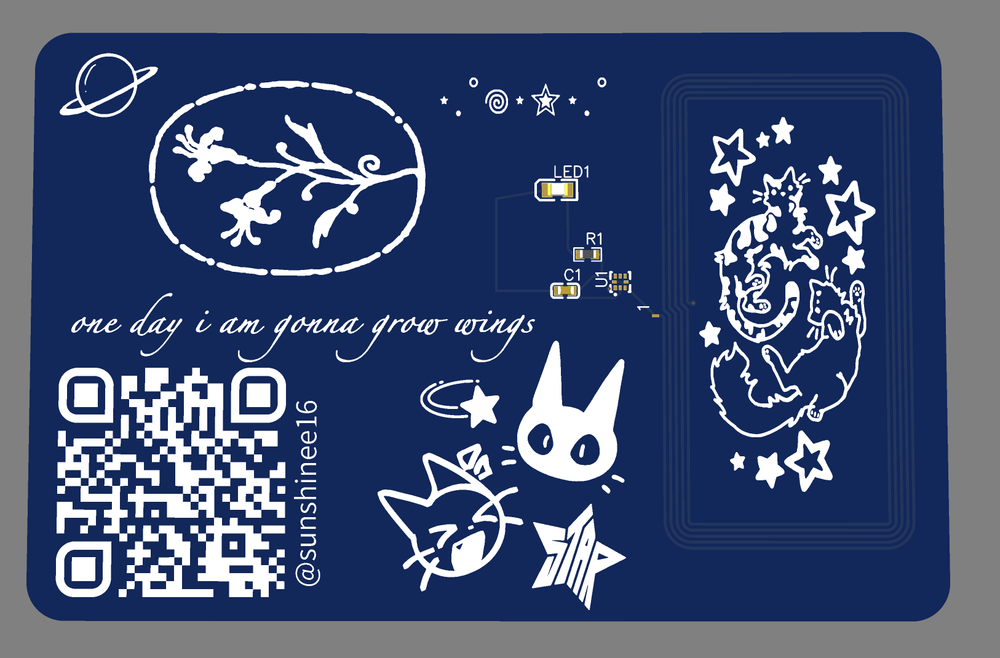
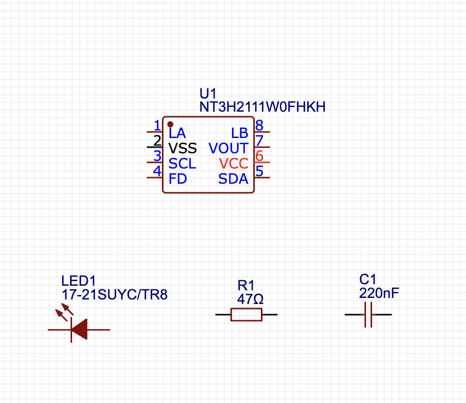
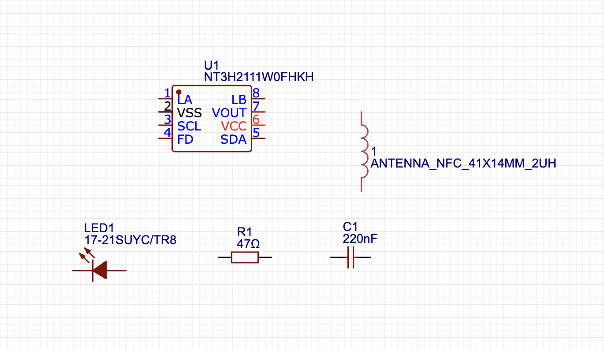
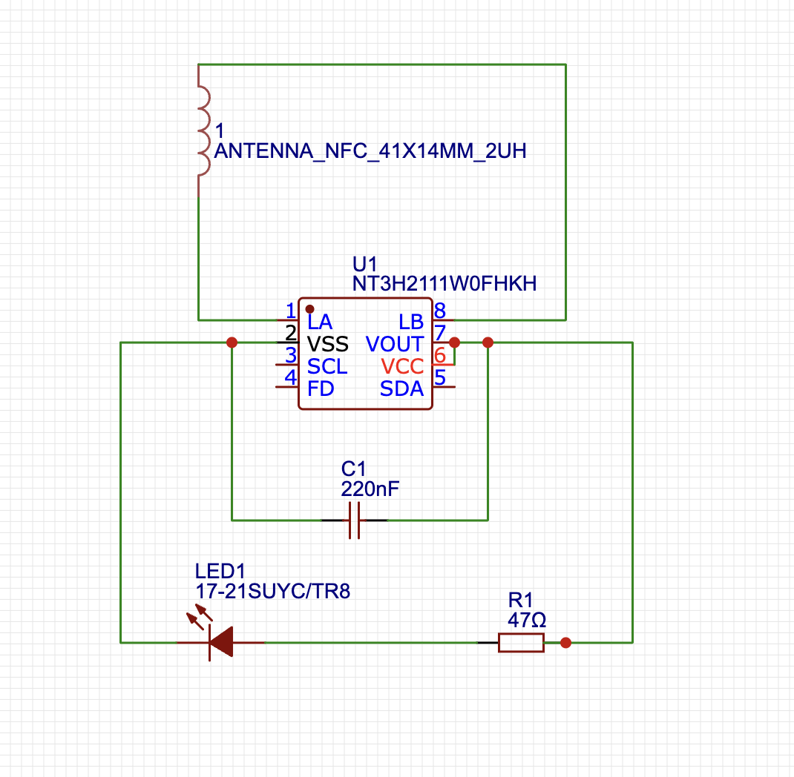
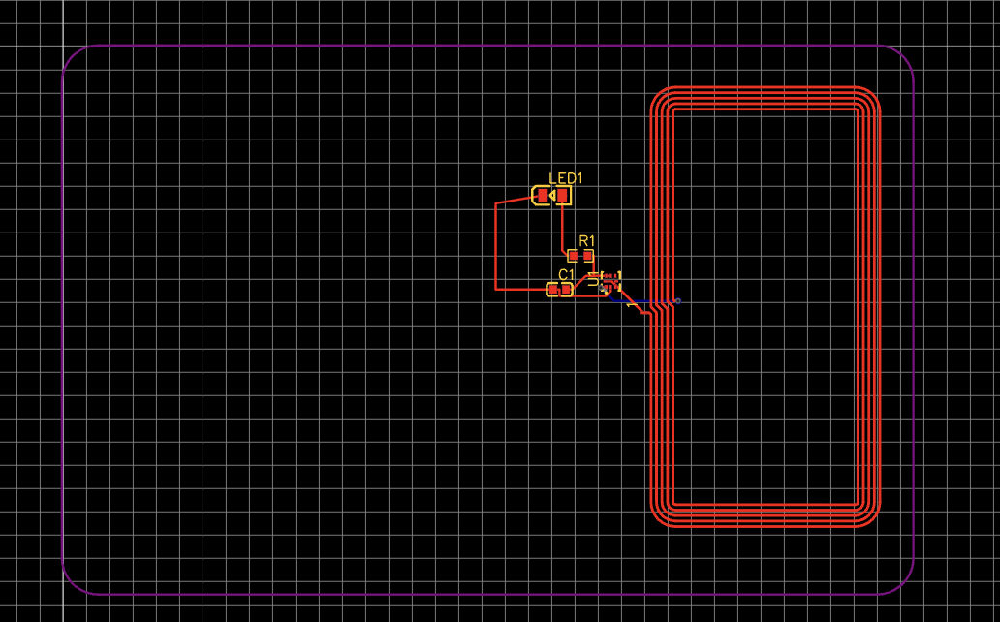
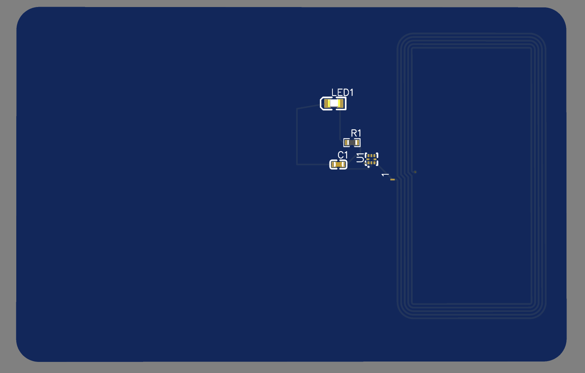
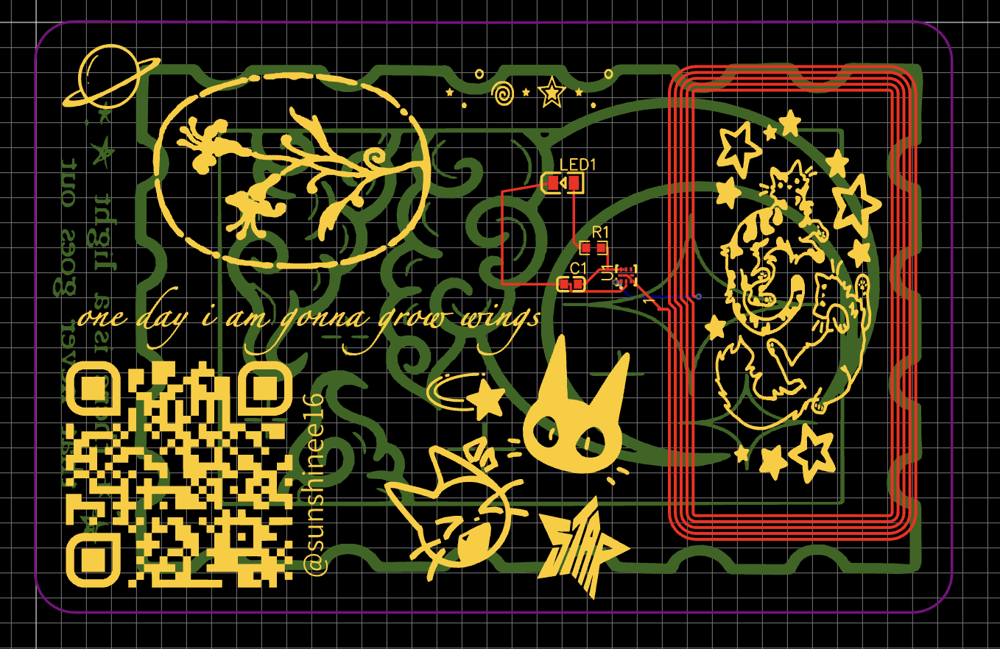
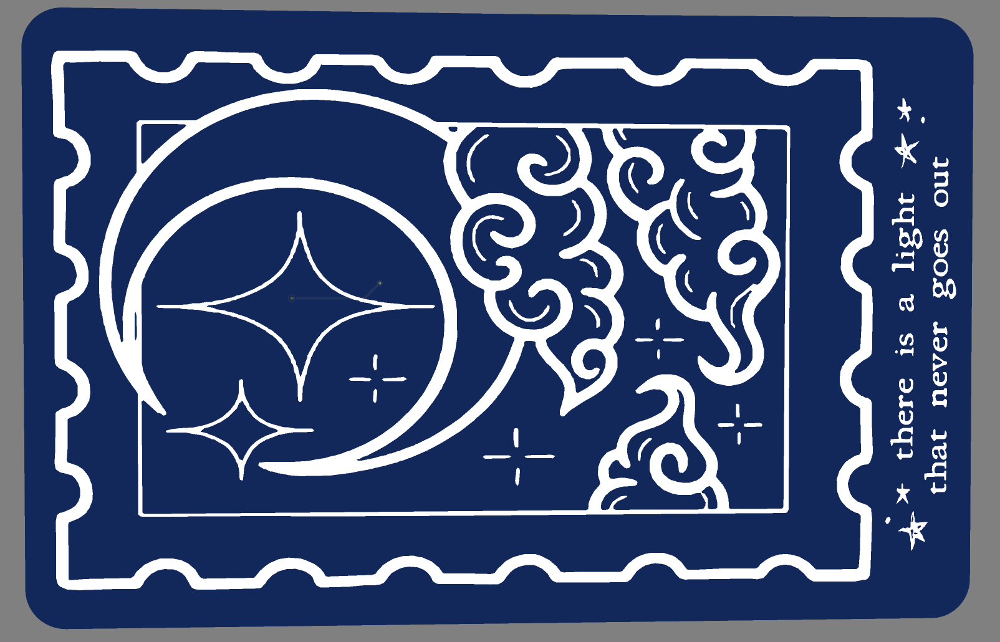
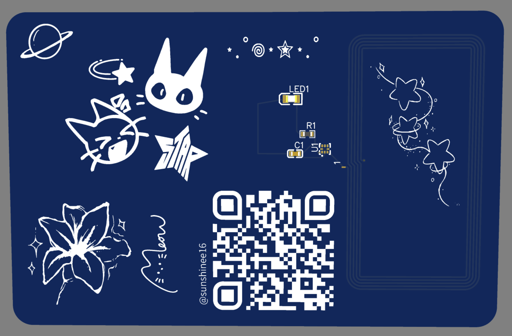
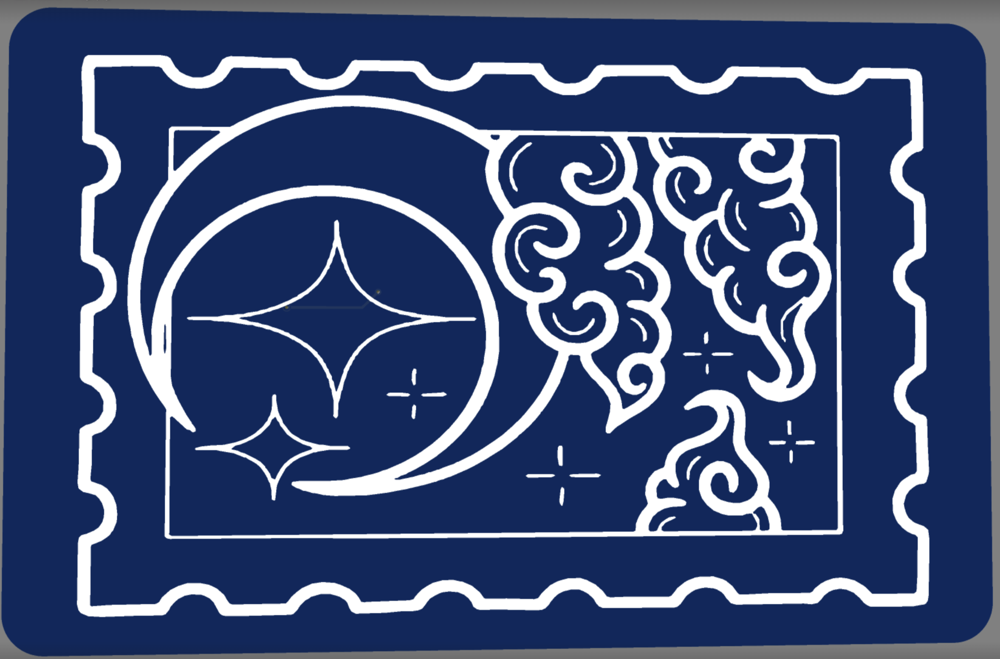

Journals! :3
--------

|title| "Hacker Card"| 
|---|---|
|github| "https://github.com/sunshinee16/hacker-card"|
|description| Hacker Card is a PCB (Printed Circuit Boards) business card with a twist - it can light up using NFC chip and custom designs|
|created_at| "18-08-2026|

-------

August 18th, 2026:
Time worked: somewhere about 20-25 minutes :3

Firstly I made the github repo :p, and the files initially - Journal.md, README.md. Then placed the components on the schematic, for this we're going to use the following components:
- A NT3H2111W0FHKH NFC Chip
- a ~2V LED 
- a 220nF capacitor
- a 47Ω resistor

 

 

For this, I've worked on finding and placing the components on the schematic board :)
----

Wiring + converting our schematic to a PCB:
Time worked: about 20 minutes asw

Next, I am going to wire all the compoments from last time to form an electrical connection. We're going to connect the capacitor between VOUT and VSS pin. For the antenna, we're wire it between LA and LB pings. Then, we'll connect the LED and resistor between the VOUT and VSS pin. 
For the NFC chip, it'll power the chip from phone to itself and hence we'll also connect VOUT and VSS pin.

----
In this part, I've converted my schematic to a PCB, arranged the footprints of the components on the board and routed traces. (oops, did not take enough screenshots :p)

---
August 19, 2026:

Now, I'm going to add art on the silkscreen of our PCB (both front and back)
I'm going to use pinterest and hit and trails to see what looks good hehe.
time spent: about 2 hrs (yeah im exhasuted)

(omg so many tries on this one! I also ended up changing the theme from what I had initially had in mind)

Final ones! :3

(3d ones):

failed attempts :loll: :

--------

YAY, THAT'S ALL! a very fun project to do :D